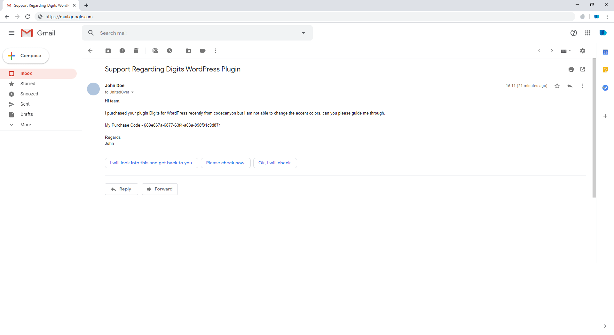
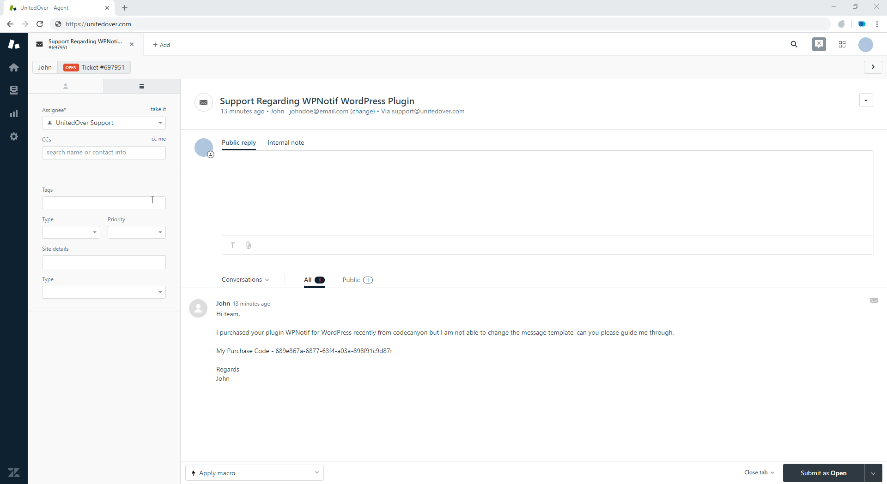

  
 # Easy Envato ⚡ 

Chrome (Chromium) Browser extension to check verify purchase of your product listed on Envato Marketplace including [ThemeForest](https://themeforest.net/ "ThemeForest"), [CodeCanyon](https://codecanyon.net/ "CodeCanyon"),  [VideoHive](https://videohive.net/ "VideoHive"),  [AudioJungle](https://audiojungle.net/ "AudioJungle"), [GraphicRiver](https://graphicriver.net/ "GraphicRiver"), [PhotoDune](https://photodune.net/ "PhotoDune"), [3DOcean](https://3docean.net/ "3DOcean")

## How does it work?

Using it is literally nothing but just selecting your purchase code in the browser and you will be shown with the details.

The extension icon is color coded and will change its color as per the status of purchase code

 - Valid purchase code and support is **not expired**

 - Valid Purchase code but support is **expired**

 - Invalid Purchase code

**You can even turn of the details card from extension settings if you just want to know the status. **

##How to set up?
1. Go to https://build.envato.com/ and log in to you envato account
2. Click on My Apps from the Menu
3. Sroll to the bottom of the page and click on "Create a New Token" button
4. Give your token a name and give "View your items' sales history" permission
5. Copy the token (you will not be able to see this token again if you miss it)
6. Go to Extension Options from Manage Extension Page -> Details
7. Paste the Token in Envato Token field.

Thats it. 👏🏻

## Browser Support
Supports all major browsers with Chrome extensions support, including Edge, Opera, Google Chrome. 

##  Contributing
We welcome all contributors, from casual to regular ❤ 
Open an issue or a pull request to suggest changes or additions.

## License
This repository is released under the [GNU General Public License v3.0](/LICENSE "GNU General Public License v3.0")

*&reg; Envato, ThemeForest, CodeCanyon, VideoHive, AudioJungle, GraphicRiver, PhotoDune, 3DOcean are trademarks of Envato Pty Ltd.*
